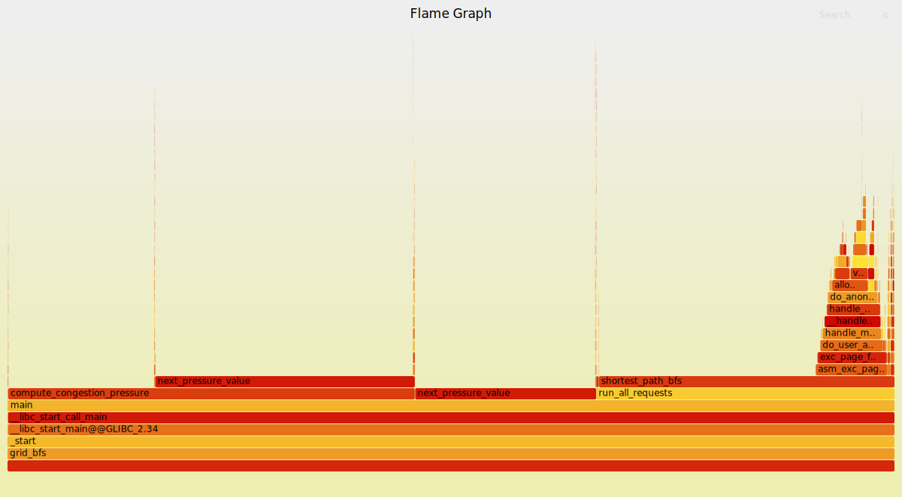
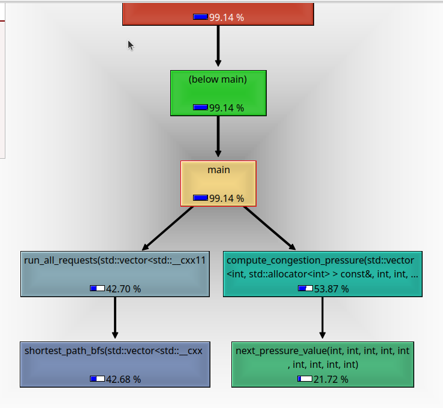

# Intro Profiling Lab Report

## 1. Optimizations Made

### Data layout optimizations

The original grid representation used `vector<string>`, introducing double indirection and poorer cache locality. This was replaced with a flat contiguous character buffer:

```cpp
struct Grid {
    const char *data;
    int rows;
    int cols;
};
```

### BFS optimizations

The original BFS implementation dynamically allocated fresh `distance` and `visited` arrays on every call causing:
* repeated heap allocation overhead,
* page faults,
* and memory leaks because the arrays were never freed.

I replaced it with static preallocated buffers:

```cpp
static uint16_t distance[kTotalCells];
static int frontier[kTotalCells];
```

Additional BFS optimizations:
* `uint16_t` distances reduced memory footprint
* blocked cells are pre-encoded directly into the distance buffer
* the BFS frontier uses a flat array instead of `vector<Point>`
* bounds checks were rewritten using unsigned comparisons:

```cpp
if ((unsigned)next_row >= (unsigned)rows ||
    (unsigned)next_col >= (unsigned)cols)
```

### Congestion kernel optimizations

The largest hotspot was `compute_congestion_pressure`.

Original implementation iterated column-major over row-major arrays:
```cpp
for (int col = 1; col < cols - 1; ++col) {
    for (int row = 1; row < rows - 1; ++row) {
```

Gives very poor cache locality. Optimized version interchanged the loops:
```cpp
for (int row = 1; row < rows - 1; ++row) {
    for (int col = 1; col < cols - 1; ++col) {
```

Further optimizations were:
* aligned static buffers using `alignas(64)`,
* replacing repeated indexing with pointer walks, (minor improvement)
* reducing repeated multiplications and index arithmetic,
* inlining `next_pressure_value`,
* replacing divisions by powers of two with shifts
* simplifying computation to enable vectorization in `next_pressure_value`

### Compiler optimizations

I added a `best` build target with aggressive optimization flags.

The optimized compiler configuration enabled:
* inlining,
* vectorization, (confirmed with `-fopt-info-vec`)
* loop optimizations,
* dead-code elimination,
* strength reduction,
* improved register allocation.

## 2. Methodology Walkthrough

Include before/after evidence from:

- `time`
- `perf stat`
- FlameGraph
- Callgrind/KCachegrind
- Valgrind leak summary

---

## AFTER - CODE OPTIMIZATIONS
Output matches:
```
grid = 260 x 260
open_cells = 51260
requests = 1200
reachable = 1177
unreachable = 23
average_distance = 180.575
route_label_checksum = 3703473789245134517
heatmap_total_visits = 32914184
heatmap_active_cells = 51041
heatmap_max_visits = 957
heatmap_threshold_checksum = 17645577948039157950
congestion_passes = 4096
congestion_total_pressure = 3719781
congestion_max_pressure = 175
congestion_pressure_checksum = 5595025244828244209
time_sec = 0.887404

real    0m0.891s
user    0m0.886s
sys     0m0.005s
```

Perf stat output becomes:
```
 Performance counter stats for './grid_bfs':

     3,952,031,030      cycles                                                                  (62.50%)
    14,656,296,402      instructions                     #    3.71  insn per cycle              (62.53%)
       982,912,108      branches                                                                (62.54%)
        24,519,363      branch-misses                    #    2.49% of all branches             (62.53%)
       154,214,734      cache-references                                                        (62.54%)
         1,367,843      cache-misses                     #    0.89% of all cache refs           (62.48%)
     3,708,804,014      L1-dcache-loads                                                         (62.45%)
        98,195,053      L1-dcache-load-misses            #    2.65% of all L1-dcache accesses   (62.44%)

       1.175598953 seconds time elapsed

       1.174269000 seconds user
       0.004000000 seconds sys
```
The optimized version shows major improvements across nearly all metrics.

Compared to the original implementation:

* runtime decreased from roughly `4.24s` to `0.89s`,
* cycles decreased from `6.31B` to `3.95B`,
* branch misses decreased from `97.5M` to `24.5M`,
* cache references decreased by roughly `10×`,
* L1 data-cache misses decreased from `1.06B` to `98M`.

The largest improvement came from fixing the cache-unfriendly traversal order in `compute_congestion_pressure`. Interchanging the loops to match row-major memory layout dramatically improved spatial locality.

Additional gains came from:

* replacing `vector<string>` with a flat grid buffer,
* reusing static BFS buffers instead of repeatedly allocating memory,
* reducing pointer indirection,
* replacing `vector<Point>` with a flat frontier array,
* reducing index arithmetic inside hot loops,
* and eliminating memory leaks from BFS allocations.

The drop in `sys` time from `0.43s` to almost negligible levels also reflects the removal of repeated allocation overhead and page-fault activity.


Valgrind output confirms no more memory leaks.
```
==141139== 
==141139== HEAP SUMMARY:
==141139==     in use at exit: 0 bytes in 0 blocks
==141139==   total heap usage: 1,205 allocs, 1,205 frees, 469,152 bytes allocated
==141139== 
==141139== All heap blocks were freed -- no leaks are possible
```

## AFTER - OPTIMIZED COMPILER FLAGS
A `best` target was added to the makefile to the compile the file with compiler optimization flags turned on. The results were:
```
grid = 260 x 260
open_cells = 51260
requests = 1200
reachable = 1177
unreachable = 23
average_distance = 180.575
route_label_checksum = 3703473789245134517
heatmap_total_visits = 32914184
heatmap_active_cells = 51041
heatmap_max_visits = 957
heatmap_threshold_checksum = 17645577948039157950
congestion_passes = 4096
congestion_total_pressure = 3719781
congestion_max_pressure = 175
congestion_pressure_checksum = 5595025244828244209
time_sec = 0.485371

real    0m0.491s
user    0m0.487s
sys     0m0.003s
```

The perf stat output is more illuminating:
```
 Performance counter stats for './grid_bfs':

     1,808,144,543      cycles                                                                  (62.28%)
     2,749,040,190      instructions                     #    1.52  insn per cycle              (62.38%)
       471,511,570      branches                                                                (62.53%)
        24,268,492      branch-misses                    #    5.15% of all branches             (62.65%)
       146,535,941      cache-references                                                        (62.67%)
         2,077,057      cache-misses                     #    1.42% of all cache refs           (62.62%)
       828,785,505      L1-dcache-loads                                                         (62.50%)
        97,796,657      L1-dcache-load-misses            #   11.80% of all L1-dcache accesses   (62.37%)

       0.833719071 seconds time elapsed

       0.831266000 seconds user
       0.006001000 seconds sys
```

Although some percentage-based metrics became worse after enabling aggressive compiler optimizations, the optimized binary still performs substantially less total work.

* cycles dropped from `3.95B` to `1.81B`,
* instructions dropped from `14.7B` to `2.75B`,
* branches dropped from `983M` to `472M`,
* runtime dropped from roughly `1.17s` to `0.83s`.

The lower IPC and higher relative miss percentages are outweighed by the large reduction in total executed instructions and cycles.

The optimized binary is also significantly smaller (`257 KB` → `41 KB`), indicating much denser generated code with more aggressive optimization and dead-code elimination.


## BEFORE

### 0 time + output
Here is output from a standard timed run.
```
grid = 260 x 260
open_cells = 51260
requests = 1200
reachable = 1177
unreachable = 23
average_distance = 180.575
route_label_checksum = 3703473789245134517
heatmap_total_visits = 32914184
heatmap_active_cells = 51041
heatmap_max_visits = 957
heatmap_threshold_checksum = 17645577948039157950
congestion_passes = 4096
congestion_total_pressure = 3719781
congestion_max_pressure = 175
congestion_pressure_checksum = 5595025244828244209
time_sec = 4.19384

real    0m4.244s
user    0m3.816s
sys     0m0.426s
```

### 1 perf stat

It was better to use `-c 3` instead of `0`. I ran:
```
taskset -c 3 perf stat -e cycles,instructions,branches,branch-misses,cache-references,cache-misses,L1-dcache-loads,L1-dcache-load-misses ./grid_bfs
```
I got:

```
 Performance counter stats for './grid_bfs':

     6,315,027,676      cycles                                                                  (62.45%)
    12,716,436,002      instructions                     #    2.01  insn per cycle              (62.46%)
     1,360,638,920      branches                                                                (62.49%)
        97,498,107      branch-misses                    #    7.17% of all branches             (62.52%)
     1,581,145,959      cache-references                                                        (62.60%)
        23,965,254      cache-misses                     #    1.52% of all cache refs           (62.50%)
     4,295,194,327      L1-dcache-loads                                                         (62.49%)
     1,064,637,311      L1-dcache-load-misses            #   24.79% of all L1-dcache accesses   (62.48%)

       4.561001071 seconds time elapsed

       4.068797000 seconds user
       0.476804000 seconds sys
```

- The L1D miss rate is considerably high for this kind of working set.
- Branch miss rate is noticeably high for a BFS-heavy workload.
- IPC of `2.01` is not great but decent considering the irregular access patterns in BFS.
- `sys` time is relatively small, so the workload is mostly CPU-bound rather than syscall-bound.

### 2 perf record

Perf record output seen via `perf report --stdio` clearly shows the hotspots.

    99.96%     0.00%  grid_bfs  grid_bfs              [.] main
                |
                ---main
                   |          
                   |--57.91%--compute_congestion_pressure(std::vector<int, std::allocator<int> > const&, int, int, int)
                   |          |          
                   |           --44.69%--next_pressure_value(int, int, int, int, int, int, int, int, int)
                   |          
                   |--34.84%--run_all_requests(std::vector<std::__cxx11::basic_string<char, std::char_traits<char>, std::allocator<char> >, std::allocator<std::__cxx11::basic_string<char, std::char_traits<char>, std::allocator<char> > > > const&, std::vector<RouteRequest, std::allocator<RouteRequest> > const&, std::vector<int, std::allocator<int> >&)
                   |          |          
                   |           --34.39%--shortest_path_bfs(std::vector<std::__cxx11::basic_string<char, std::char_traits<char>, std::allocator<char> >, std::allocator<std::__cxx11::basic_string<char, std::char_traits<char>, std::allocator<char> > > > const&, RouteRequest const&, std::vector<int, std::allocator<int> >&)
                   |                     |          
                   |                      --8.59%--asm_exc_page_fault
                   |                                |...
                    --7.16%--next_pressure_value(int, int, int, int, int, int, int, int, int)

- It is clear that the primary hotspot is `compute_congestion_pressure`.

    60.24%    23.34%  grid_bfs  grid_bfs              [.] compute_congestion_pressure(std::vector<int, std::allocator<int> > const&, int, int, int)
                |          
                |--36.90%--compute_congestion_pressure(std::vector<int, std::allocator<int> > const&, int, int, int)
                |          |          
                |           --28.28%--next_pressure_value(int, int, int, int, int, int, int, int, int)
                |          
                 --23.34%--_start
                           __libc_start_main@@GLIBC_2.34
                           __libc_start_call_main
                           main
                           |          
                           |--21.01%--compute_congestion_pressure(std::vector<int, std::allocator<int> > const&, int, int, int)
                           |          |          
                           |           --16.41%--next_pressure_value(int, int, int, int, int, int, int, int, int)
                           |          
                            --2.33%--next_pressure_value(int, int, int, int, int, int, int, int, int)

- The hotspot is expected from the source code because the loop iterates column-major over row-major arrays, producing poor spatial locality.
- The next major hotspot is `next_pressure_value`. Since it executes for every innermost loop iteration, even small arithmetic and function-call overheads become amplified over hundreds of millions of calls.

    60.30%    41.00%  grid_bfs  grid_bfs              [.] next_pressure_value(int, int, int, int, int, int, int, int, int)
                |          
                |--41.00%--_start
                |          __libc_start_main@@GLIBC_2.34
                |          __libc_start_call_main
                |          main
                |          |          
                |          |--36.32%--compute_congestion_pressure(std::vector<int, std::allocator<int> > const&, int, int, int)
                |          |          |          
                |          |           --27.88%--next_pressure_value(int, int, int, int, int, int, int, int, int)
                |          |          
                |           --4.67%--next_pressure_value(int, int, int, int, int, int, int, int, int)
                |          
                 --19.30%--next_pressure_value(int, int, int, int, int, int, int, int, int)
                           |          
                            --0.50%--asm_sysvec_apic_timer_interrupt
                                      sysvec_apic_timer_interrupt

- BFS takes a smaller but still significant fraction of runtime.
- A large number of page faults occur inside BFS.
- This is likely caused by repeatedly allocating fresh `distance` and `visited` buffers inside every BFS invocation.

### 3 FlameGraph

FlameGraph output agrees with the perf report and makes it easy to visually identify hotspots.



### 4 gprof output

> [!warn]
> Here I see a deviation from what is stated in the README. I explain it below.

Gprof output attributes relatively more time to BFS than `compute_congestion_pressure`.

    Each sample counts as 0.01 seconds.
      %   cumulative   self              self     total           
     time   seconds   seconds    calls   s/call   s/call  name    
      33.95      2.21     2.21     1200     0.00     0.00  shortest_path_bfs(std::vector<std::__cxx11::basic_string<char, std::char_traits<char>, std::allocator<char> >, std::allocator<std::__cxx11::basic_string<char, std::char_traits<char>, std::allocator<char> > > > const&, RouteRequest const&, std::vector<int, std::allocator<int> >&)
      17.51      3.35     1.14 1941504792     0.00     0.00  std::vector<int, std::allocator<int> >::operator[](unsigned long)
      15.05      4.33     0.98        1     0.98     2.98  compute_congestion_pressure(std::vector<int, std::allocator<int> > const&, int, int, int)
      10.52      5.01     0.69 272646144     0.00     0.00  next_pressure_value(int, int, int, int, int, int, int, int, int)
       7.07      5.47     0.46     1200     0.00     0.00  __gnu_cxx::__enable_if<!std::__is_scalar<Point>::__value, void>::__type std::__fill_a1<Point*, Point>(Point*, Point*, Point const&)
       3.38      5.70     0.22 130804910     0.00     0.00  std::vector<std::__cxx11::basic_string<char, std::char_traits<char>, std::allocator<char> >, std::allocator<std::__cxx11::basic_string<char, std::char_traits<char>, std::allocator<char> > > >::operator[](unsigned long) const
       2.92      5.88     0.19 272646144     0.00     0.00  int const& std::min<int>(int const&, int const&)

This can largely be explained by the fact that the gprof build uses `-O0 -pg`:
- many compiler optimizations such as inlining and vectorization are disabled,
- and `-pg` inserts instrumentation (`mcount`) into functions, perturbing execution characteristics.

This disproportionately affects tiny high-frequency functions like `next_pressure_value`.

> [!note]
> Experiment: the output becomes closer to the `perf` profile when compiled with `-O2`.

    Each sample counts as 0.01 seconds.
      %   cumulative   self              self     total           
     time   seconds   seconds    calls   s/call   s/call  name    
      50.87      2.34     2.34     1200     0.00     0.00  shortest_path_bfs(std::vector<std::__cxx11::basic_string<char, std::char_traits<char>, std::allocator<char> >, std::allocator<std::__cxx11::basic_string<char, std::char_traits<char>, std::allocator<char> > > > const&, RouteRequest const&, std::vector<int, std::allocator<int> >&)
      27.17      3.59     1.25 272646144     0.00     0.00  next_pressure_value(int, int, int, int, int, int, int, int, int)
      21.96      4.60     1.01    67601     0.00     0.00  compute_congestion_pressure(std::vector<int, std::allocator<int> > const&, int, int, int)

All reports still consistently identify the major optimization opportunities:

- `compute_congestion_pressure`
  - corroborated by the poor access pattern in the code,
  - especially the column-major traversal over row-major arrays.

- `shortest_path_bfs`
  - corroborated by both `perf` and `gprof`,
  - significant page faults occur inside the BFS workload.

- `next_pressure_value`
  - corroborated by both `perf` and `gprof`,
  - very high call frequency makes even small per-call costs significant.

### 5 valgrind - memcheck

Next step is checking for memory leaks. This is orthogonal to performance profiling but equally important.

    ==76974== LEAK SUMMARY:
    ==76974==    definitely lost: 8,450,000 bytes in 50 blocks
    ==76974==    indirectly lost: 0 bytes in 0 blocks
    ==76974==      possibly lost: 0 bytes in 0 blocks
    ==76974==    still reachable: 0 bytes in 0 blocks
    ==76974==         suppressed: 0 bytes in 0 blocks
    ==76974== 
    ==76974== For lists of detected and suppressed errors, rerun with: -s
    ==76974== ERROR SUMMARY: 2 errors from 2 contexts (suppressed: 0 from 0)

It is clear from both the code and the Valgrind output that there is a leak in the BFS routine due to dynamically allocated arrays that are never freed.

### 6 cachegrind

Genuinely fun tool to use.

#### Caller graph - Cycle estimation

Matches expectations from `perf` and `gprof`.



#### Cache metrics

Here I found something particularly interesting that would have been difficult to infer independently:

- Cachegrind showed that `compute_congestion_pressure` accounted for roughly **65–70% of L1 data-cache read/write misses**.
- The main cause was the column-major traversal of row-major arrays, producing large-stride accesses and poor spatial locality.
- However, BFS accounted for roughly **60% of last-level (LL) data-cache misses**.
- BFS accesses memory less predictably due to frontier-based traversal.
- BFS also repeatedly allocates fresh `distance` and `visited` buffers, reducing temporal locality and increasing accesses that propagate beyond lower cache levels.
- This indicates that `compute_congestion_pressure` primarily suffers from L1 locality problems, while BFS generates more expensive deep-cache and memory accesses.
- This strongly suggests loop interchange and buffer reuse as high-impact optimizations.

## 3. Correctness Evidence

Include:

- `make test`
- Final normal run output
- Checksum comparison before and after optimization

---

Make test output:
```
g++ -std=c++20 -Wall -Wextra -pedantic -O2 -g grid_bfs.cpp -o grid_bfs
./grid_bfs --test
sanity check passed
```

Diff between outputs (as shown above) is empty!
```
$ diff output.txt _output.txt 
16c16
< time_sec = 1.48355
---
> time_sec = 4.19384
\ No newline at end of file
```

## 4. Conceptual Questions

Answer Q1.1 through Q6.1 from the README.

### Q1.1

`real` gives total wall-clock time. `user` measures time spent executing user-space code across all threads, while `sys` measures time spent executing kernel code.

`real` may be larger because of waiting on I/O or blocking operations.

`real` may also be smaller than `user + sys` when multiple threads execute in parallel and their CPU times accumulate.

At this stage `sys` time is relatively negligible.

### Q2.1

Hardware counters may not remain active for the entire execution duration because of multiplexing. Perf scales raw event counts using the ratio of time running to time enabled.

Derived metrics are arithmetic combinations of counters, for example:

    IPC = instructions / cycles

### Q2.2

These percentages indicate the fraction of time for which the hardware counter was active ("running") relative to the total enabled duration.

### Q2.3

No, these are approximate counts for several reasons:

- PMU sampling and multiplexing introduce estimation error.
- Some events may be delayed because of interrupt skid.
- Cache-related counters may include effects from hardware prefetching.
- Different microarchitectures expose different hardware events and counter implementations.
- Some counters may only sample every Nth event rather than every occurrence.

### Q3.1

Frame pointers store a stable reference to the current stack frame during a function call.

Compilers often omit frame pointers to free an additional register and reduce overhead. However, preserving frame pointers improves stack unwinding and call-graph reconstruction during profiling.

This is why profiling builds commonly use:

    -fno-omit-frame-pointer

Debug information generated by `-g` and DWARF unwind metadata can also be used for stack unwinding.

### Q3.2

Inclusive cost = self cost + children cost.

Self cost measures time spent exclusively inside a function's own instructions, excluding callees.

### Q4.1

1. `gprof` performs statistical sampling by periodically interrupting execution and recording the current instruction pointer into histogram buckets associated with functions.

2. The `-pg` flag also inserts `mcount` instrumentation calls which track caller-callee relationships and call frequencies.

### Q4.2

1. `perf` is primarily sampling-based, whereas `gprof` additionally instruments function calls using `mcount`.

2. `perf` can access hardware performance counters through the kernel PMU interface, whereas `gprof` operates entirely in user space.

### Q5.1

#### Valgrind

Valgrind is a runtime instrumentation framework which executes the program inside a virtualized environment while tracking allocations, frees, and memory accesses.

It incurs a very large slowdown but provides detailed leak detection, invalid access detection, and memory propagation tracking.

Valgrind does not require recompilation.

#### ASan

ASan is a compiler-based sanitizer enabled during compilation.

It inserts shadow-memory checks around memory accesses and allocations while typically incurring significantly lower overhead than Valgrind.

ASan is often preferred during normal development and CI because of its lower runtime overhead, while Valgrind is useful for deeper memory debugging and leak analysis.

### Q6.1

Yes. `gprof` attributed relatively more time to BFS, while `perf` showed `compute_congestion_pressure` as the dominant hotspot.

This is not a real contradiction. `perf` uses low-overhead statistical sampling on optimized code paths, while `gprof` relies on instrumentation (`-pg`) that adds function-call overhead and alters compiler optimizations, especially affecting tiny high-frequency functions like `next_pressure_value`.